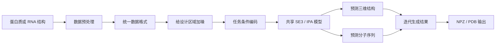

# NanoDesign

NanoDesign 是一个用于生物分子设计的多任务 AI 框架。

它希望用同一个模型，同时完成以下三类任务：

- 蛋白质或多肽 Binder 设计
- 抗体 CDR 设计
- RNA 设计

模型可以同时生成氨基酸或核苷酸序列，以及分子的粗粒度三维结构。

> 当前版本属于研究原型，已经完成端到端训练和生成流程，但还不是成熟的全原子分子设计系统。

## NanoDesign 能做什么？

| 任务 | 保持不变的部分 | 模型设计的部分 |
| --- | --- | --- |
| Binder 设计 | 目标蛋白 | Binder 的序列和三维结构 |
| 抗体设计 | 抗原和抗体 Framework | CDR 的序列和三维结构 |
| RNA 设计 | 当前版本没有固定结构条件 | RNA 序列和粗粒度三维结构 |

模型只修改指定的设计区域，其他部分在加噪、训练和生成过程中都会保持固定。

## 整体架构

整个流程可以简单理解为：

1. 把 Binder、抗体和 RNA 转换成统一的数据格式。
2. 对需要设计的序列和三维结构加入噪声。
3. 告诉模型当前是什么任务、哪些区域可以修改。
4. 模型根据固定上下文恢复正确的结构和序列。
5. 推理时从随机状态开始，逐步生成新的设计结果。

## 核心设计

### 1. 三种任务共用一个模型

NanoDesign 不为 Binder、抗体和 RNA 分别训练三个完全独立的模型，而是使用一个共享模型。

输入中会标记：

- 当前任务类型
- 当前残基属于蛋白质还是 RNA
- 当前区域是 Target、Binder、Antigen、Framework、CDR 还是 RNA
- 当前残基属于哪条链
- 哪些区域允许模型修改

这样模型可以学习不同任务之间共享的三维几何规律。

### 2. 同时设计序列和结构

模型会同时预测：

- 每个残基的三维位置
- 每个残基的三维方向
- 蛋白质氨基酸或 RNA 核苷酸类型
- 用于表示局部几何的三个关键原子位置

蛋白质和 RNA 使用不同的 token 编号，避免把氨基酸和核苷酸混淆。

### 3. 固定上下文不会被改变

对于 Binder 设计，Target 保持固定；对于抗体设计，Antigen 和 Framework 保持固定。

这个限制会在数据加噪、模型内部结构更新、迭代生成和最终输出阶段持续生效。因此，模型只会生成用户指定的设计区域。

### 4. 统一的三维几何模型

NanoDesign 使用 Invariant Point Attention（IPA）处理三维结构。

模型不仅考虑序列信息，还会利用残基之间的距离、方向、链关系和分子角色。整体模型对分子的旋转和平移具有几何一致性，更适合处理三维分子结构。

## 训练和生成

训练时，NanoDesign 会给设计区域的坐标、方向和序列加入噪声，然后让模型恢复原始结构和序列。三个任务会进行平衡计算，避免某一个任务完全主导训练。

生成时，设计区域从随机坐标、随机方向和 Mask 序列开始。模型反复预测更合理的结果，逐步生成最终设计。

结果可以输出为：

- NPZ：保存序列、坐标和旋转矩阵
- PDB：保存关键原子，用于结构查看和后续处理

## 当前已经实现

- Binder、抗体 CDR 和 RNA 三类任务
- 一个共享的多任务模型
- 序列和粗粒度三维结构联合生成
- 固定上下文保护
- 蛋白质和 RNA 独立词表
- 数据校验、来源记录和 SHA256 指纹
- 单 GPU 和多 GPU 训练
- Checkpoint 保存和恢复训练
- 隐藏标签评分流程
- 位置、旋转、序列恢复率和界面接触等评估指标
- NPZ 和 PDB 预测结果输出
- 三类任务的 H100 端到端 smoke test

## 当前限制

NanoDesign 目前主要证明了完整流程可以运行和学习，还不能证明模型具有可靠的科学泛化能力。

主要限制包括：

- 目前只有很小的公开测试数据，还没有大规模、严格去重的数据集。
- 输出是残基级粗粒度结构，不包含完整侧链和全部原子。
- 自由生成效果明显弱于中间噪声状态下的结构恢复。
- 旋转预测仍然比较弱。
- 抗体 CDR 还没有使用正式的 ANARCI/IMGT 编号流程。
- 还没有完成结构折叠、Docking、能量、可开发性或实验验证。

## 下一步计划

1. 构建 Binder、抗体和 RNA 的大规模去重数据集。
2. 提高自由生成和三维旋转的准确度。
3. 加入完整原子、侧链和扭转角生成。
4. 加入正式的抗体编号和任务专用数据处理。
5. 接入结构预测、Docking 和自洽性评估工具。
6. 使用多个随机种子进行正式对比实验。

## 项目定位

NanoDesign 当前是一个可以运行、训练、评估和生成结果的多任务分子设计研究框架。

它已经搭建好了数据、模型、训练、评分和推理的完整基础设施。下一阶段的重点是扩大训练数据、提高自由生成质量，并加入更严格的外部科学验证。
